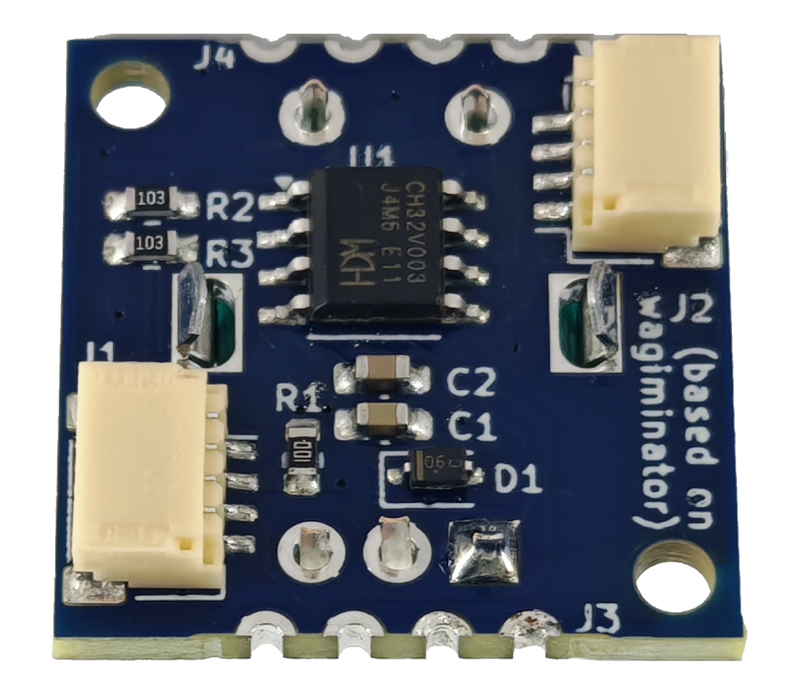
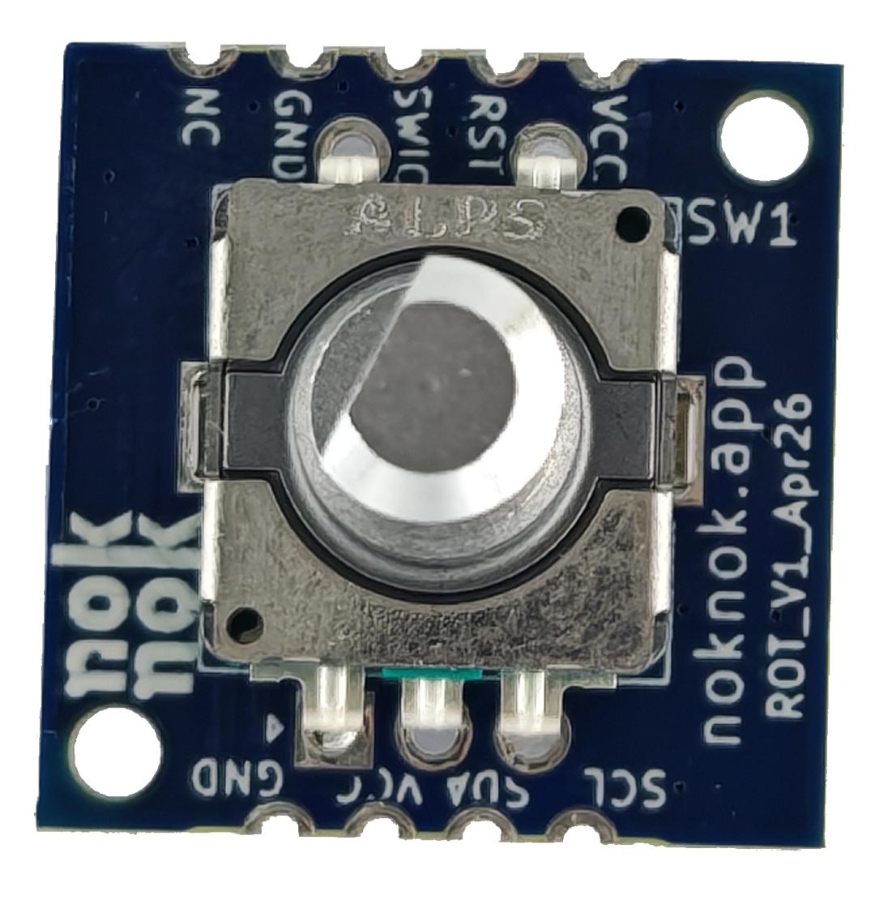

# noknok Knob

An I²C-controlled rotary encoder module for the noknok ecosystem.
Designed for smooth, reliable user input: volume control, menu navigation, parameter adjustment, and more.




---

## Overview

The **noknok Knob** uses a CH32V003J4M6 microcontroller to read a mechanical EC11 rotary encoder with integrated push button. It exposes position, delta, and button state over I²C using the standard noknok JST SH 4-pin connector. The I²C address is assigned dynamically at boot by the noknok Conductor — no address conflicts when using multiple modules.

Typical use cases:
- Volume / brightness control
- Menu navigation
- Parameter tuning (speed, mode, color)
- General UI input for kits and finished products

---

## Hardware

| Property | Value |
|---|---|
| PCB size | 20 × 20 mm |
| MCU | CH32V003J4M6 (SOP-8) |
| Encoder | EC11 rotary encoder with push button |
| Connector | JST SH 4-pin (Qwiic / Stemma QT compatible) |
| Supply voltage | 3.3 V |
| Logic voltage | 3.3 V |
| Hardware version | v1.0 |

### Pinout (CH32V003J4M6 SOP-8)

| Pin name | Function |
|---|---|
| PA2 | Encoder A (active LOW, internal pull-up) |
| PD6 / PA1 | Encoder B (active LOW, read as PA1) |
| PC4 | Push button S2 (active LOW; S1 and C are grounded) |
| PC1 | I²C SDA |
| PC2 | I²C SCL |
| PD1 / PD4 / PD5 | SWDIO — firmware flashing only |

### noknok Connector (JST SH 4-pin)

| Pin | Signal |
|---|---|
| 1 | GND |
| 2 | 3.3 V |
| 3 | SDA |
| 4 | SCL |

---

## Firmware

**Version: v1.5**

### Enumeration

The module uses the standard noknok dynamic enumeration protocol — no hardcoded I²C address.

**→ Full protocol spec:** [Ecosystem / software / enumeration.md](https://github.com/buildwithnoknok/Ecosystem/blob/main/software/enumeration.md)

### I²C Protocol (normal operation)

**Pico reads 4 bytes:**

| Byte | Content |
|---|---|
| 0–1 | Signed 16-bit position, big-endian |
| 2 | Signed 8-bit delta since last read (auto-clears on read) |
| 3 | Button state: `0x01` = pressed, `0x00` = released |

> Button state is suppressed for 150 ms after any rotation to prevent false triggers from mechanical shaft coupling.

**Pico writes:**

| Command | Effect |
|---|---|
| `[0x10]` | Reset position to 0 |
| `[0x11, posH, posL]` | Set position to signed 16-bit value |

### Encoder counting

- Hardware EXTI interrupts on both edges of PA1 and PA2 catch every quadrature transition immediately.
- A sub-step accumulator divides by 2: **2 raw transitions = 1 position count**, giving exactly **1 count per physical detent**.

---

## Python Driver

Part of the [noknok Ecosystem](https://github.com/buildwithnoknok/Ecosystem) — see `software/pico/noknok.py`.

```python
from noknok import Conductor

c = Conductor()
c.enumerate()                  # discovers all modules (~3 s)

knob = c.knob[0]               # first knob by discovery order
# or: knob = c.role["volume"]  # by role name after setup_roles()

s = knob.read()
if s is not None:
    print(s.position)          # signed int, cumulative turns
    print(s.delta)             # change since last read (auto-clears)
    print(s.pressed)           # True if button held down

knob.reset()                   # set position to 0
knob.set_position(50)          # set to any signed 16-bit value
```

---

## Firmware

Source is in `firmware/src/`. To build and flash, clone this repo alongside your ch32fun installation and run:

```bash
cd firmware/src
make        # compile
make flash  # compile + flash via WCH Link-E
```

> ch32fun must be installed at `../ch32fun/` relative to `firmware/src/` — see [cnlohr/ch32v003fun](https://github.com/cnlohr/ch32v003fun) for setup instructions.

---

## Status

| Item | Status |
|---|---|
| Hardware | v1.0 complete |
| Firmware | v1.5 complete |
| Python driver | Complete (`NoknokKnob` in [Ecosystem repo](https://github.com/buildwithnoknok/Ecosystem/tree/main/software/pico)) |
| Documentation | Complete |

---

## License

[Creative Commons BY-SA 3.0](http://creativecommons.org/licenses/by-sa/3.0/)