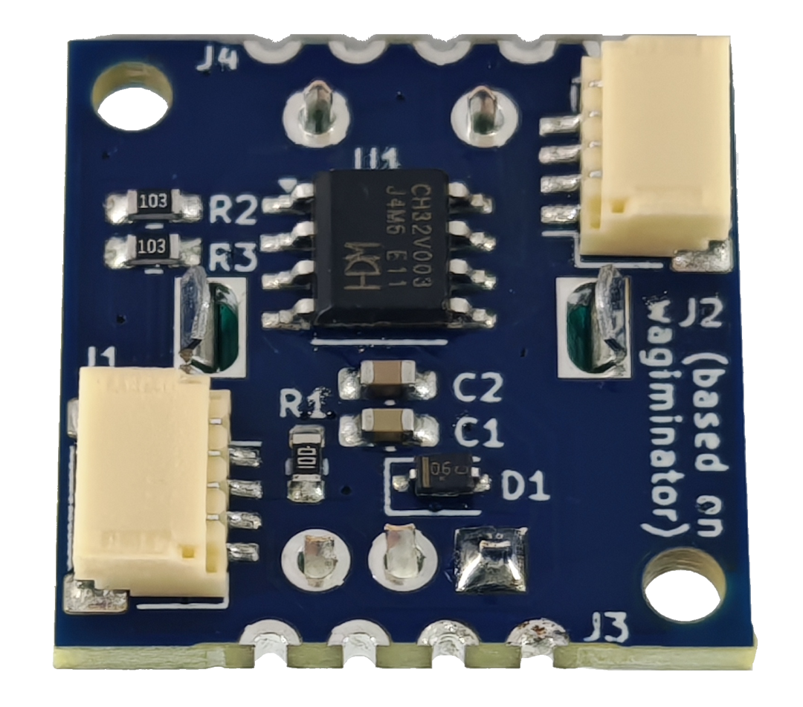
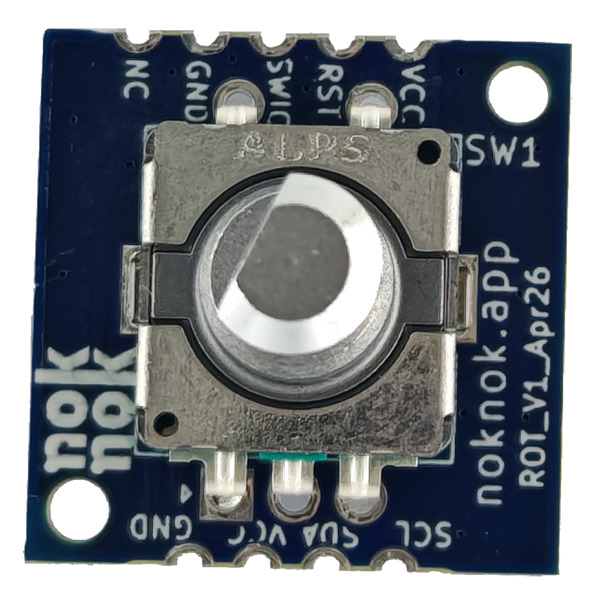

# noknok Knob

An I²C-controlled rotary encoder module for the noknok ecosystem.
Designed for smooth, reliable user input: volume control, menu navigation, parameter adjustment, and more.




---

## Overview

The **noknok Knob** uses a CH32V003J4M6 microcontroller to read a mechanical EC11 rotary encoder with integrated push button. It exposes position, delta, and button state over I²C using the standard noknok JST SH 4-pin connector. The I²C address is assigned dynamically at boot by the noknok Conductor — no address conflicts when using multiple modules.

Typical use cases:
- Volume / brightness control
- Menu navigation
- Parameter tuning (speed, mode, color)
- General UI input for kits and finished products

---

## Hardware

| Property | Value |
|---|---|
| PCB size | 20 × 20 mm |
| MCU | CH32V003J4M6 (SOP-8) |
| Encoder | EC11 rotary encoder with push button |
| Connector | JST SH 4-pin (Qwiic / STEMMA QT compatible) |
| Supply voltage | 3.3 V |
| Logic voltage | 3.3 V |
| Hardware version | v2.0 |

### Pinout (CH32V003J4M6 SOP-8)

| Pin name | Function |
|---|---|
| PA2 | Encoder A (active LOW, internal pull-up) |
| PD6 / PA1 | Encoder B (active LOW, read as PA1) |
| PC4 | Push button S2 (active LOW; S1 and C are grounded) |
| PC1 | I²C SDA |
| PC2 | I²C SCL |
| PD1 / PD4 / PD5 | SWDIO — firmware flashing (3-pad pogo pads, J3) + status LED (D2, active LOW) share the PD1/SWIO net |

### noknok Connector (JST SH 4-pin)

| Pin | Signal |
|---|---|
| 1 | GND |
| 2 | 3.3 V |
| 3 | SDA |
| 4 | SCL |

---

## Firmware

**Version: v2.3.0 (bootloader‑hosted)**

### Enumeration

The module uses the standard noknok dynamic enumeration protocol — no hardcoded I²C address.

**→ Full protocol spec:** [Ecosystem / software / enumeration.md](https://github.com/buildwithnoknok/Ecosystem/blob/main/software/enumeration.md)

### I²C Protocol (normal operation)

**Pico reads 4 bytes:**

| Byte | Content |
|---|---|
| 0–1 | Signed 16-bit position, big-endian |
| 2 | Signed 8-bit delta since last read (auto-clears on read) |
| 3 | Button state: `0x01` = pressed, `0x00` = released |

> Button state is suppressed for 150 ms after any rotation to prevent false triggers from mechanical shaft coupling.

**Pico writes:**

| Command | Effect |
|---|---|
| `[0x10]` | Reset position to 0 |
| `[0x11, posH, posL]` | Set position to signed 16-bit value |
| `[0xB0]` | Enter bootloader — reset into the I²C bootloader for an OTA firmware update (see [Firmware](#firmware-1)) |
| `[0xB1]` | Get version — standard noknok command; the next read returns 4 version bytes (see below) |

**Version read** — `GET_VERSION` (`0xB1`) is a **noknok ecosystem-standard** command (the `0xB0`–`0xBF` range is reserved for standard commands across every module). Write `0xB1`, then read **4 bytes**: `[PROTOCOL_VERSION, FW_MAJOR, FW_MINOR, FW_PATCH]` = `[0x01, 2, 3, 0]`. Lets the Conductor compare the installed version against the version required by the product manifest. **→ Full spec:** [Ecosystem / software / readme.md §5](https://github.com/buildwithnoknok/Ecosystem/blob/main/software/readme.md#5-standard-system-commands)

### Encoder counting

- Hardware EXTI interrupts on both edges of PA1 and PA2 catch every quadrature transition immediately.
- A sub-step accumulator divides by 2: **2 raw transitions = 1 position count**, giving exactly **1 count per physical detent**.

---

## Python Driver

Part of the [noknok Ecosystem](https://github.com/buildwithnoknok/Ecosystem) — see `software/pico/noknok.py`.

```python
from noknok import Conductor

c = Conductor()
c.enumerate()                  # discovers all modules (~3 s)

knob = c.knob[0]               # first knob by discovery order
# or: knob = c.role["volume"]  # by role name after setup_roles()

s = knob.read()
if s is not None:
    print(s.position)          # signed int, cumulative turns
    print(s.delta)             # change since last read (auto-clears)
    print(s.pressed)           # True if button held down

knob.reset()                   # set position to 0
knob.set_position(50)          # set to any signed 16-bit value
```

---

## Firmware

**v2.3.0 runs under the shared noknok I²C bootloader** ([module-I2C-bootloader](https://github.com/buildwithnoknok/module-I2C-bootloader)) — the module can be re‑flashed **over the I²C bus** (no SWDIO cable in the field). The application is linked at the `0x1400` offset (`app.ld`) above the 5 KB stage-0 + stage-1 bootloader (layout 2) and reserves the top 16 B of RAM for the bootloader handoff cell. Command `0xB0` drops the running module into the bootloader for an update.

```bash
cd firmware/src
make build   # compile the offset-linked application -> knob_firmware.bin
```

> ch32fun must be installed at `../ch32fun/` relative to `firmware/src/` — see [cnlohr/ch32v003fun](https://github.com/cnlohr/ch32v003fun) for setup.

Flashing: normally over I²C from the Pico (`module_flasher.py` in `brain-Pico`). A blank board needs the bootloader SWD‑flashed once first. SWD remains the unbrickable backstop — see *Recovery & SWD flashing* in the [bootloader README](https://github.com/buildwithnoknok/module-I2C-bootloader#recovery--swd-flashing). `make flash` here still does a one‑off SWD flash of the app for bench bring‑up.

---

## Changelog

### v2.3.0 — app base 0x1400 (bootloader layout 2)
Relinked at the `0x1400` flash offset (bootloader **layout 2**: 1 KB stage-0 + 4 KB stage-1 below the app; was `0x1000`). Firmware behaviour unchanged. **Not compatible with the legacy monolithic bootloader or a layout-1 stage-1** — such a module gets stage-0 + stage-1 v1.1.0 over SWD first, then this app over I²C. See [module-I2C-bootloader](https://github.com/buildwithnoknok/module-I2C-bootloader).

### v2.2.0 — watchdog + boot-health handshake (DEV-31)
Runs the independent watchdog (~2 s, kicked every main-loop pass) and writes `0` to `0x200007F8` the moment its I²C address is assigned — the app-health handshake with the stage-1 bootloader. Stage-1 counts watchdog resets and parks the module (error 7, rescued by the Conductor by UID) after three in a row, instead of booting a broken app forever. Contract: [Ecosystem / software / bootloader-update.md §3](https://github.com/buildwithnoknok/Ecosystem/blob/main/software/bootloader-update.md). No protocol or command change.

### v2.1 and earlier
See the git history.

## Status

| Item | Status |
|---|---|
| Hardware | v2.0 complete |
| Firmware | v2.3.0 complete (bootloader‑hosted, I²C OTA) |
| Python driver | Complete (`NoknokKnob` in [Ecosystem repo](https://github.com/buildwithnoknok/Ecosystem/tree/main/software/pico)) |
| Documentation | Complete |

---

## License

- Firmware / code: MIT — see [LICENSE](LICENSE).
- Hardware (schematics, PCB layout, fab files): CC BY-SA 4.0 — see [LICENSE-hardware](LICENSE-hardware).

## Trademarks

**noknok** is a registered trademark in Switzerland (Swissreg 1300007033).

Qwiic is a registered trademark of SparkFun Electronics, Inc. STEMMA QT is a
trademark of Adafruit Industries, LLC. Both are named here only to state
connector compatibility - noknok is not affiliated with, endorsed by, or
sponsored by either company.
---

---

## Safety & Liability

noknok hardware is an electronic device and a DIY/maker kit. You assemble, modify, flash, power, and operate it at your own risk, and it is provided as is, without warranty. See the full notice: [License, Safety & Liability](https://buildwithnoknok.github.io/safety-and-license/).